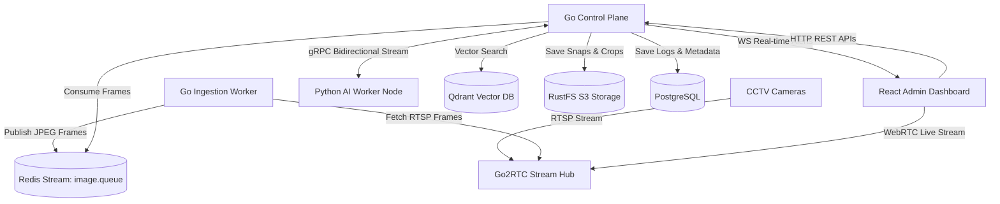

# Face Recognition CCTV System (Distributed Architecture)

ระบบวิเคราะห์และจดจำใบหน้าจากกล้อง CCTV แบบกระจายศูนย์ (Distributed Architecture) ที่รองรับการประมวลผลกล้องจำนวนมากแบบ Real-time โดยส่งเฟรมภาพผ่าน Redis Stream และประมวลผล AI ด้วย Python worker ผ่าน gRPC แบบ Stateless พร้อมหน้าแดชบอร์ดควบคุมระบบ (Admin Dashboard)

## 🏗️ System Architecture

ระบบถูกออกแบบให้เป็น **Distributed Microservices** เพื่อรองรับการสเกลอย่างมีประสิทธิภาพ:



### รายละเอียดการทำงานของแต่ละส่วน (Component Details)
1. **Go2RTC Stream Hub (Port 1984, 8554, 8555)**: ทำหน้าที่จัดการและแปลงสตรีมกล้อง RTSP/WebRTC ให้พร้อมใช้งานสำหรับทั้ง Ingester และ หน้าจอ Frontend (WebRTC)
2. **Go Ingestion (go-ingestion)**: ดึงเฟรมจาก go2rtc จากนั้นย่อ/แปลงรูปเป็น JPEG แล้วนำไปใส่ไว้ใน Redis Stream (`image.queue`) ช่วยถอดรหัสและส่งผ่านวิดีโอประสิทธิภาพสูง
3. **Go Control Plane (go-control-plane) (Port 8000, 50051)**:
   - เป็น Core Controller ของระบบ
   - ควบคุมการโหลดเฟรมจาก Redis Stream และจ่ายงาน (Dispatch) ให้กับ AI Worker ที่ว่างผ่าน gRPC stream
   - จัดการ Vector search บน Qdrant
   - ทำการ Crop ใบหน้าแบบ JPEG จากกล้อง และบันทึกรูป Snapshot และ Crop ลง S3 (RustFS)
   - จัดการข้อมูลของระเบียนประชากร กล้อง และบันทึกประวัติการตรวจจับลง PostgreSQL
   - ให้บริการ API แก่ Frontend (REST + WebSocket Real-time Broadcast)
4. **Python AI Worker (backend) (gRPC Client)**:
   - ประมวลผล AI แบบ **Stateless** เชื่อมต่อไปยัง Control Plane
   - ใช้ **InsightFace (buffalo_l + ArcFace)** ในการตรวจจับและดึง face embedding
   - **Worker-side Face Tracking & Quality Buffering**: ติดตามใบหน้าบนฝั่ง worker และเก็บสะสมเฟรมที่มีคุณภาพใบหน้าดีที่สุด (Face Area ขนาดใหญ่ที่สุด) ในหน้าต่างการตรวจจับ เพื่อส่งเฉพาะรูปและ embedding ที่ดีที่สุดกลับไปที่ Control Plane ช่วยประหยัดแบนด์วิดท์และลดภาระของระบบหลังบ้านได้อย่างมหาศาล
   - **Local Cooldown**: กำหนดคูลดาวน์ (30 วินาที) ของแต่ละใบหน้าบนฝั่ง worker เพื่อป้องกันการตรวจจับซ้ำซาก
5. **React Dashboard Frontend (frontend) (Port 80)**:
   - แดชบอร์ดแนวโมเดิร์นแบบ Premium Glassmorphism (Dark Mode)
   - หน้าสำหรับดู Live กล้องสดผ่าน WebRTC (เชื่อมต่อ go2rtc)
   - ระบบบริหารจัดการกล้อง (Camera Management)
   - ระบบลงทะเบียนใบหน้า (Face Management) รองรับการอัปโหลดใบหน้าทีละหลายรูป
   - ระบบดูประวัติการตรวจจับ (Detection Logs) แสดงผลแบบเปรียบเทียบรูป Snapshot, Face Crop, และหน้าจริงที่ลงทะเบียนไว้เคียงข้างกัน (Side-by-Side comparison)

---

## ⚡ Tech Stack

| Component | Technology |
|-----------|-----------|
| **Control Plane** | Go 1.20+, Fiber, GORM, gRPC Server |
| **Ingestion Worker** | Go 1.20+, go2rtc clients |
| **AI Worker** | Python 3.10+, gRPC Client, InsightFace, OpenCV |
| **Vector Database** | Qdrant (Vector similarity search) |
| **Relational Database** | PostgreSQL (Metadata, config, logs) |
| **Object Storage** | RustFS (S3-compatible storage) |
| **Message Broker** | Redis (Streams & IPC) |
| **Media Stream Server** | go2rtc (WebRTC, RTSP, HLS) |
| **Frontend** | React 18, TypeScript, Vite, WebRTC |

---

## 🚀 Quick Start (ด้วย Docker Compose)

ทางเลือกที่ดีที่สุดในการเริ่มใช้งานระบบคือการรันผ่าน Docker Compose ซึ่งจะสร้างโครงสร้างพื้นฐานและบริการทั้งหมดขึ้นมาโดยอัตโนมัติ

### สิ่งที่จำเป็นต้องมี (Prerequisites)
- Docker และ Docker Compose (หรือ Docker Desktop)

### ขั้นตอนการรัน

1. **โคลนและเตรียมไฟล์คอนฟิก**
   ตรวจสอบความถูกต้องของ RTSP Streams ในไฟล์ `go2rtc.yaml` ก่อนรัน:
   ```yaml
   streams:
     cam_2:
       - rtsp://your-camera-url
   ```

2. **สั่งรันระบบผ่าน Docker Compose**
   ```bash
   docker compose up --build -d
   ```
   คำสั่งนี้จะทำการ build อิมเมจของ Frontend, Go Control Plane, Go Ingestion, และ Python AI Worker รวมถึงดึงอิมเมจของฐานข้อมูลต่างๆ

3. **พอร์ตที่เปิดให้บริการ (Port Map)**
   - 💻 **Frontend Dashboard**: http://localhost (Port 80)
   - ⚙️ **Control Plane API**: http://localhost:8000
   - 👁️ **go2rtc Web UI**: http://localhost:1984
   - 🗄️ **RustFS Console**: http://localhost:9001 (User: `admin`, Pass: `admin12345`)
   - 🔍 **Qdrant API Dashboard**: http://localhost:6333/dashboard

---

## 🛠️ โครงสร้างโปรเจกต์ (Project Structure)

```
face-rec/
├── backend/                  # Python AI Worker
│   ├── app/
│   │   └── face_engine.py    # InsightFace Wrapper
│   ├── ai_worker_grpc.py     # gRPC client, Tracking & Quality buffer
│   ├── requirements.txt      # Python dependencies
│   └── Dockerfile            # Python Worker Docker configuration
├── go-control-plane/         # Go API & Controller (The Brain)
│   ├── db.go                 # GORM Database models & postgres config
│   ├── draw.go               # draw bboxes & CropJPEG functions
│   ├── grpc_server.go        # gRPC Server & Redis Stream consumer
│   ├── handlers.go           # REST APIs (Cameras, Persons, Detections)
│   ├── main.go               # Application entry point
│   ├── qdrant.go             # Qdrant Vector integration
│   ├── s3.go                 # S3 (RustFS) integration
│   └── Dockerfile
├── go-ingestion/             # Go Frame Ingestion Worker
│   ├── main.go               # RTSP stream decoder -> Redis Stream push
│   └── Dockerfile
├── frontend/                 # React UI
│   ├── src/
│   │   ├── pages/            # Dashboard, Detections, Persons, Cameras
│   │   ├── components/       # Custom modals & visual components
│   │   └── api/              # API Client (Axios + WS endpoints)
│   └── Dockerfile
├── facerec.proto             # gRPC Protobuf definition
├── go2rtc.yaml               # Media stream config
└── docker-compose.yml        # Orchestration configurations
```

---

## ⚙️ Configuration & Environment Variables

คุณสามารถปรับแต่งพฤติกรรมของระบบผ่านตัวแปรสภาพแวดล้อม (Environment Variables) ใน `docker-compose.yml`:

### AI Worker (`backend`)
- `CONTROL_PLANE_URL`: ชี้ไปยังที่อยู่ gRPC server (เช่น `control-plane:50051`)
- **โค้ดภายใน**:
  - `TRACK_TIMEOUT = 3.0` (วินาที): ตรวจจับว่าไม่มีใบหน้านั้นเกิน 3 วินาที จะถือว่าสิ้นสุด track
  - `TRACK_MAX_DURATION = 5.0` (วินาที): บังคับ flush หน้าดีที่สุด หากตรวจจับแช่อยู่นานเกิน 5 วินาที
  - `COOLDOWN_DURATION = 30.0` (วินาที): ป้องกันการยิงหน้าซ้ำในช่วงเวลาคูลดาวน์

### Go Control Plane (`go-control-plane`)
- `REDIS_URL`: ที่อยู่ของ Redis Broker (เช่น `redis:6379`)
- `POSTGRES_HOST`, `POSTGRES_PORT`, `POSTGRES_USER`, `POSTGRES_PASSWORD`, `POSTGRES_DB`: การเชื่อมต่อฐานข้อมูล PostgreSQL
- `QDRANT_URL`: ที่อยู่บริการ Qdrant Vector Database (เช่น `http://qdrant:6333`)
- `S3_ENDPOINT`: ที่อยู่บริการ RustFS S3 (เช่น `rustfs:9000`)
- `GO2RTC_URL`: ที่อยู่ตัวกลางจัดการวิดีโอ (เช่น `http://go2rtc:1984`)

---

## 🎮 Hardware Acceleration (NVIDIA / AMD / Intel Onboard)

ระบบรองรับการใช้ฮาร์ดแวร์เร่งความเร็วในการประมวลผลโมเดลตรวจจับใบหน้า (InsightFace / ONNX Runtime) เพื่อเพิ่มประสิทธิภาพและความรวดเร็วในการทำงาน:

### 1. วิธีเลือกแพ็กเกจ ONNX Runtime
เปิดไฟล์ [requirements.txt](file:///Users/n.kittichaiwattanaku/Documents/face-rec/backend/requirements.txt) และเลือกติดตั้งแพ็กเกจที่ตรงตามประเภทของการ์ดจอ/ฮาร์ดแวร์ของคุณ (เปิดใช้งานเพียงตัวเดียว และให้ปิดตัวอื่นเป็น comment ไว้เพื่อป้องกันปัญหาแพ็กเกจชนกัน):
* **Intel Onboard GPU / CPU**: ใช้ `onnxruntime-openvino` (แนะนำอย่างยิ่งสำหรับประมวลผลบนชิปกราฟิกออนบอร์ดของ Intel)
* **AMD GPU (Linux ROCm)**: ใช้ `onnxruntime-rocm`
* **AMD/Intel GPU (Windows)**: ใช้ `onnxruntime-directml`
* **NVIDIA GPU**: ใช้ `onnxruntime-gpu`
* **CPU ทั่วไป / Apple Silicon**: ใช้ `onnxruntime` (ค่าเริ่มต้น)

### 2. วิธีตั้งค่าใน `docker-compose.yml`
แก้ไขส่วนของบริการ `ai-worker` ในไฟล์ [docker-compose.yml](file:///Users/n.kittichaiwattanaku/Documents/face-rec/docker-compose.yml) เพื่อเชื่อมโยงชิปการ์ดจอและกำหนดค่าตัวแปร:
* **การส่งผ่าน (Passthrough) การ์ดจอ Intel/AMD (สำหรับระบบ Linux)**:
  ปลด comment ส่วนของ `devices` เพื่อส่งต่อไดรเวอร์ไดเร็กทอรีเข้าไปในคอนเทนเนอร์:
  ```yaml
  devices:
    - /dev/dri:/dev/dri
  ```
* **บังคับเรียกใช้งาน Execution Provider ที่เฉพาะเจาะจง**:
  ปลด comment ตัวแปรสภาพแวดล้อม `ONNX_PROVIDER` ใน `environment` เพื่อเลือกใช้ตัวประมวลผลกราฟิกที่ต้องการ:
  ```yaml
  environment:
    - CONTROL_PLANE_URL=control-plane:50051
    - ONNX_PROVIDER=OpenVINOExecutionProvider  # สำหรับ Intel GPU (ผ่าน OpenVINO)
    # - ONNX_PROVIDER=ROCmExecutionProvider      # สำหรับ AMD GPU (ผ่าน Linux ROCm)
  ```

---

## 🪟 Windows Exe Compilation (สำหรับ Client Windows)

ระบบรองรับการรัน AI Worker บน Windows ในรูปแบบแอปพลิเคชัน GUI ที่มีหน้าต่างกรอกการตั้งค่าและแสดงประวัติ Log สด:

### 1. วิธีรัน GUI ด้วย Python Script
หากเครื่อง Windows มี Python 3.9+ ติดตั้งอยู่แล้ว สามารถรันสคริปต์ได้โดยตรง:
```bash
cd backend
pip install -r requirements.txt
python ai_worker_gui.py
```

### 2. วิธีคอมไพล์เป็นไฟล์เดี่ยว `.exe` (Windows Binary)
สามารถสร้างไฟล์ EXE ได้ง่ายๆ บนเครื่อง Windows:
1. ดับเบิ้ลคลิกไฟล์ [build_win.bat](file:///Users/n.kittichaiwattanaku/Documents/face-rec/backend/build_win.bat) ในโฟลเดอร์ `backend`
2. สคริปต์จะทำการติดตั้ง `pyinstaller` และไลบรารีทั้งหมดใน `requirements.txt` ให้โดยอัตโนมัติ
3. จากนั้นระบบจะรวมโค้ดและไลบรารีออกมาเป็นไฟล์เดี่ยวที่โฟลเดอร์ `backend/dist/FaceRec_AI_Worker.exe`

### 3. วิธีการใช้งาน GUI บน Windows
เมื่อเปิดใช้งาน `FaceRec_AI_Worker.exe` จะมีหน้าต่างแอปพลิเคชันแสดงขึ้นมา:
- **Control Plane URL**: ช่องระบุที่อยู่ของ Go Control Plane (เช่น `192.168.1.100:50051` หรือ `localhost:50051`)
- **Execution Provider**: กล่องเลือกตัวเร่งความเร็วการ์ดจอ (เช่น เลือก `DmlExecutionProvider` สำหรับ AMD GPU / Intel Onboard บน Windows หรือ `CUDAExecutionProvider` สำหรับ NVIDIA GPU)
- **Start/Stop Button**: กดปุ่ม **Start Worker** เพื่อเริ่มทำงาน และสามารถกด **Stop Worker** เพื่อหยุดชั่วคราวและแก้ไขการเชื่อมต่อได้สะดวก
- **Log Window**: แสดงข้อมูลและสถานะการสตรีมประมวลผลแบบ Real-time ของกล้องทุกตัว

