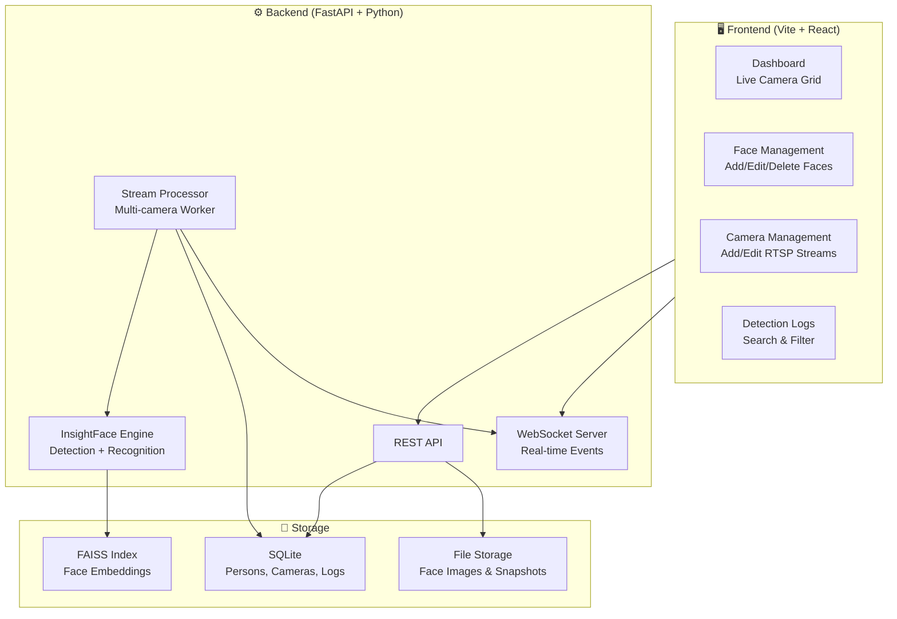

# Face Recognition CCTV System — Implementation Plan

## Overview

ระบบ Face Recognition จากกล้อง CCTV ที่รองรับกล้องได้จำนวนมาก พร้อมระบบหลังบ้านสำหรับจัดการใบหน้า, จัดการกล้อง, และแสดง log ว่าเจอหน้าใครที่ไหนเมื่อไร



---

## User Review Required

> [!IMPORTANT]
> **Technology Choices**: ระบบนี้ออกแบบให้ run บน local machine (laptop/desktop) ก่อน ใช้ SQLite + FAISS แทน PostgreSQL + Milvus เพื่อความง่ายในการ setup โดยสามารถ upgrade ภายหลังได้

> [!IMPORTANT]
> **GPU Support**: ระบบจะตรวจสอบ GPU อัตโนมัติ ถ้ามี CUDA จะใช้ GPU ถ้าไม่มีจะ fallback เป็น CPU (ช้ากว่าแต่ใช้งานได้)

> [!WARNING]
> **Camera Protocol**: ระบบรองรับ RTSP streams เป็นหลัก สำหรับ USB webcam จะรองรับด้วย OpenCV device index. หากต้องการ ONVIF หรือ protocol อื่นกรุณาแจ้ง

---

## Proposed Changes

### Architecture Overview

| Component | Technology | Purpose |
|-----------|-----------|---------|
| **Backend API** | FastAPI (Python) | REST API + WebSocket |
| **Face Engine** | InsightFace (buffalo_l) | Detection + Recognition |
| **Vector Search** | FAISS | Face embedding similarity search |
| **Database** | SQLite + SQLAlchemy | Metadata, logs, camera config |
| **Frontend** | Vite + React + TypeScript | Admin dashboard |
| **Real-time** | WebSocket | Push detection events to UI |
| **Stream Processing** | OpenCV + multiprocessing | Multi-camera frame capture |

---

### Component 1: Backend (Python FastAPI)

#### [NEW] `backend/requirements.txt`
Dependencies: `fastapi`, `uvicorn`, `sqlalchemy`, `insightface`, `opencv-python-headless`, `faiss-cpu`, `numpy`, `onnxruntime`, `python-multipart`, `websockets`, `Pillow`, `aiosqlite`

#### [NEW] `backend/app/main.py`
- FastAPI application entry point
- CORS middleware configuration
- Router registration
- Startup event: load InsightFace model + FAISS index
- Shutdown event: save FAISS index

#### [NEW] `backend/app/database.py`
- SQLAlchemy async engine (aiosqlite)
- Session factory
- Base model class

#### [NEW] `backend/app/models.py`
SQLAlchemy models:
- **Person**: `id`, `name`, `department`, `notes`, `created_at`, `updated_at`
- **PersonFace**: `id`, `person_id`, `image_path`, `embedding` (blob), `created_at`
- **Camera**: `id`, `name`, `url` (RTSP/device), `location`, `is_active`, `fps_process`, `created_at`
- **DetectionLog**: `id`, `person_id`, `camera_id`, `confidence`, `snapshot_path`, `detected_at`

#### [NEW] `backend/app/face_engine.py`
- InsightFace model loading (buffalo_l or buffalo_sc)
- `detect_faces(frame)` → list of face bounding boxes + embeddings
- `compare_embedding(embedding, threshold)` → matched person or unknown
- FAISS index management (add, remove, search)

#### [NEW] `backend/app/stream_processor.py`
- Multi-camera stream manager using `multiprocessing`
- Per-camera worker: OpenCV capture → frame skip → detect → recognize → log
- Push detection events via internal queue → WebSocket broadcast
- Graceful start/stop per camera

#### [NEW] `backend/app/routers/persons.py`
REST API:
- `GET /api/persons` — List all persons
- `POST /api/persons` — Create person
- `GET /api/persons/{id}` — Get person detail
- `PUT /api/persons/{id}` — Update person
- `DELETE /api/persons/{id}` — Delete person
- `POST /api/persons/{id}/faces` — Upload face image(s)
- `DELETE /api/persons/{id}/faces/{face_id}` — Remove face

#### [NEW] `backend/app/routers/cameras.py`
REST API:
- `GET /api/cameras` — List all cameras
- `POST /api/cameras` — Add camera
- `PUT /api/cameras/{id}` — Update camera
- `DELETE /api/cameras/{id}` — Delete camera
- `POST /api/cameras/{id}/start` — Start processing
- `POST /api/cameras/{id}/stop` — Stop processing
- `GET /api/cameras/{id}/snapshot` — Get current frame

#### [NEW] `backend/app/routers/detections.py`
REST API:
- `GET /api/detections` — List detection logs (paginated, filterable by person/camera/date)
- `GET /api/detections/stats` — Detection statistics
- `GET /api/detections/{id}` — Detection detail with snapshot

#### [NEW] `backend/app/routers/ws.py`
WebSocket endpoint:
- `WS /ws/detections` — Real-time detection event stream
- `WS /ws/camera/{id}` — Live camera frame stream (MJPEG-like)

#### [NEW] `backend/app/schemas.py`
Pydantic models for request/response validation

---

### Component 2: Frontend (Vite + React)

#### [NEW] `frontend/` — Vite React TypeScript project

#### Design System
- **Theme**: Dark mode with glassmorphism effects
- **Colors**: Deep navy (#0a0e27) base, electric blue (#3b82f6) accent, emerald (#10b981) success
- **Typography**: Inter font from Google Fonts
- **Components**: Cards with blur backdrop, smooth transitions, micro-animations

#### Pages

##### Dashboard (`/`)
- **Camera Grid**: แสดง live feed จากกล้องทั้งหมดในรูปแบบ grid
- **Real-time Detection Feed**: sidebar แสดง event ล่าสุดแบบ real-time (WebSocket)
- **Statistics Cards**: จำนวนกล้อง online, จำนวนคนที่ลงทะเบียน, detection วันนี้

##### Face Management (`/persons`)
- **Person List**: ตาราง/card view แสดงรายชื่อทั้งหมด
- **Add Person**: Form + upload ภาพหน้า (รองรับหลายภาพ)
- **Person Detail**: แสดงข้อมูล + ภาพหน้าทั้งหมด + detection history

##### Camera Management (`/cameras`)
- **Camera List**: แสดงสถานะ online/offline
- **Add Camera**: Form กรอก RTSP URL, ชื่อ, ตำแหน่ง
- **Camera Preview**: แสดง live feed + snapshot

##### Detection Logs (`/detections`)
- **Log Table**: ตารางแสดง detection ทั้งหมด (ใคร, ที่ไหน, เมื่อไร, confidence)
- **Filters**: กรอง by person, camera, date range
- **Snapshot View**: คลิกดู snapshot ที่ถ่ายตอน detect

---

### Component 3: File Structure

```
face-rec/
├── backend/
│   ├── requirements.txt
│   ├── app/
│   │   ├── __init__.py
│   │   ├── main.py
│   │   ├── config.py
│   │   ├── database.py
│   │   ├── models.py
│   │   ├── schemas.py
│   │   ├── face_engine.py
│   │   ├── stream_processor.py
│   │   └── routers/
│   │       ├── __init__.py
│   │       ├── persons.py
│   │       ├── cameras.py
│   │       ├── detections.py
│   │       └── ws.py
│   ├── data/
│   │   ├── faces/          # Uploaded face images
│   │   ├── snapshots/      # Detection snapshots
│   │   ├── face_rec.db     # SQLite database
│   │   └── faiss.index     # FAISS vector index
│   └── Dockerfile
├── frontend/
│   ├── package.json
│   ├── vite.config.ts
│   ├── index.html
│   ├── src/
│   │   ├── main.tsx
│   │   ├── App.tsx
│   │   ├── index.css
│   │   ├── api/
│   │   │   └── client.ts
│   │   ├── components/
│   │   │   ├── Layout.tsx
│   │   │   ├── Sidebar.tsx
│   │   │   ├── CameraFeed.tsx
│   │   │   ├── DetectionCard.tsx
│   │   │   ├── PersonCard.tsx
│   │   │   └── StatsCard.tsx
│   │   ├── pages/
│   │   │   ├── Dashboard.tsx
│   │   │   ├── Persons.tsx
│   │   │   ├── PersonDetail.tsx
│   │   │   ├── Cameras.tsx
│   │   │   └── Detections.tsx
│   │   └── hooks/
│   │       ├── useWebSocket.ts
│   │       └── useApi.ts
│   └── Dockerfile
├── docker-compose.yml
└── README.md
```

---

## Open Questions

> [!IMPORTANT]
> 1. **ภาษาของ UI**: ต้องการให้ UI เป็นภาษาไทยหรืออังกฤษ? (แนะนำอังกฤษเพราะเป็นมาตรฐาน แต่สามารถทำเป็นไทยได้)

> [!IMPORTANT]
> 2. **จำนวนกล้องที่คาดว่าจะใช้**: ประมาณกี่ตัว? (ส่งผลต่อการออกแบบ stream processor)
>    - 1-10 ตัว: multiprocessing ปกติ
>    - 10-50 ตัว: ต้องใช้ process pool + frame skipping optimization
>    - 50+ ตัว: ต้อง distributed architecture (Kafka + worker nodes)

> [!IMPORTANT]
> 3. **Authentication**: ต้องการระบบ login สำหรับ admin panel หรือไม่? (Phase แรกจะทำแบบ open access ก่อน)

---

## Verification Plan

### Automated Tests
1. **Backend unit tests**: ทดสอบ face_engine, FAISS index, API endpoints
2. **API integration tests**: ทดสอบ CRUD operations ผ่าน FastAPI TestClient
3. **Frontend build**: ตรวจสอบว่า build สำเร็จไม่มี TypeScript errors

### Manual Verification
1. **ทดสอบ face enrollment**: Upload ภาพหน้า → ตรวจสอบ embedding ถูกสร้าง
2. **ทดสอบ camera connection**: เชื่อมต่อ webcam/RTSP → ดู live feed บน dashboard
3. **ทดสอบ face recognition**: ยืนหน้ากล้อง → ตรวจสอบ detection log
4. **ทดสอบ UI**: เปิด dashboard ผ่าน browser → ตรวจสอบ layout, navigation, real-time updates
