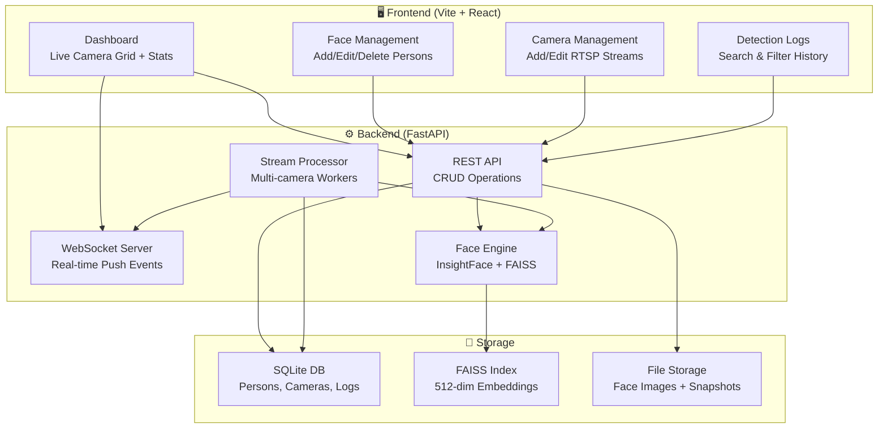

# Face Recognition CCTV System — Detailed Implementation Plan

## Overview

ระบบ Face Recognition จากกล้อง CCTV ที่รองรับกล้องได้จำนวนมาก พร้อมระบบหลังบ้าน (Admin Dashboard) สำหรับ:
- **จัดการใบหน้า**: เพิ่ม/ลบ/แก้ไข person + upload ภาพหน้าหลายภาพ
- **จัดการกล้อง**: เพิ่ม/ลบ/แก้ไข RTSP/USB camera, start/stop processing
- **Real-time Detection**: แสดง live feed + detection events แบบ real-time
- **Detection Logs**: ค้นหาว่าเจอใคร ที่ไหน เมื่อไร พร้อม snapshot



---

## Technology Stack

| Layer | Technology | Version | Rationale |
|-------|-----------|---------|-----------|
| **Backend Framework** | FastAPI | 0.115+ | Async, auto-docs, WebSocket support |
| **Face Detection** | InsightFace (SCRFD) | 0.7+ | State-of-the-art accuracy, lightweight |
| **Face Recognition** | InsightFace (ArcFace) | buffalo_l | 512-dim embeddings, high accuracy |
| **Vector Search** | FAISS (faiss-cpu) | 1.8+ | Fast similarity search, no server needed |
| **Database** | SQLite + SQLAlchemy | 2.0+ | Zero-config, sufficient for local/medium scale |
| **Video Capture** | OpenCV | 4.9+ | RTSP/USB support, frame manipulation |
| **Frontend** | Vite + React + TS | React 18 | Fast HMR, type safety |
| **Real-time** | WebSocket | native | Push detection events + live feed |
| **Styling** | Vanilla CSS | - | Full control, glassmorphism, dark theme |

---

## Detailed File Structure

```
face-rec/
├── backend/
│   ├── requirements.txt
│   ├── run.py                          # Entry point: uvicorn runner
│   ├── app/
│   │   ├── __init__.py
│   │   ├── main.py                     # FastAPI app, middleware, lifespan
│   │   ├── config.py                   # Settings (paths, thresholds, model)
│   │   ├── database.py                 # SQLAlchemy engine, session, init_db
│   │   ├── models.py                   # ORM models (Person, PersonFace, Camera, DetectionLog)
│   │   ├── schemas.py                  # Pydantic request/response schemas
│   │   ├── face_engine.py              # InsightFace wrapper + FAISS index
│   │   ├── stream_processor.py         # Multi-camera stream manager
│   │   ├── event_bus.py                # In-memory event bus for WebSocket broadcast
│   │   └── routers/
│   │       ├── __init__.py
│   │       ├── persons.py              # Person CRUD + face upload
│   │       ├── cameras.py              # Camera CRUD + start/stop
│   │       ├── detections.py           # Detection logs + stats
│   │       └── ws.py                   # WebSocket endpoints
│   └── data/                           # Runtime data (auto-created)
│       ├── faces/                      # Uploaded face images
│       ├── snapshots/                  # Detection snapshot images
│       ├── face_rec.db                 # SQLite database
│       └── faiss.index                 # FAISS vector index
│
├── frontend/
│   ├── package.json
│   ├── vite.config.ts
│   ├── index.html
│   ├── src/
│   │   ├── main.tsx                    # React entry point
│   │   ├── App.tsx                     # Router + Layout
│   │   ├── index.css                   # Global styles + design system
│   │   ├── api/
│   │   │   └── client.ts              # Axios/fetch wrapper for all API calls
│   │   ├── components/
│   │   │   ├── Layout.tsx              # App shell: sidebar + main content
│   │   │   ├── Sidebar.tsx             # Navigation sidebar
│   │   │   ├── CameraFeed.tsx          # Live camera feed component (img polling)
│   │   │   ├── DetectionCard.tsx       # Single detection event card
│   │   │   ├── PersonCard.tsx          # Person avatar + info card
│   │   │   ├── StatsCard.tsx           # Animated stat card
│   │   │   ├── Modal.tsx               # Reusable modal dialog
│   │   │   └── LoadingSpinner.tsx      # Loading indicator
│   │   ├── pages/
│   │   │   ├── Dashboard.tsx           # Main dashboard (camera grid + live feed)
│   │   │   ├── Persons.tsx             # Person list + add person
│   │   │   ├── PersonDetail.tsx        # Person detail + face management
│   │   │   ├── Cameras.tsx             # Camera list + add camera
│   │   │   └── Detections.tsx          # Detection log table + filters
│   │   └── hooks/
│   │       ├── useWebSocket.ts         # WebSocket connection hook
│   │       └── useApi.ts               # API fetch hook with loading/error state
│   └── public/
│       └── favicon.svg
│
└── README.md                           # Setup & run instructions
```

---

## Phase 1: Backend Core

### 1.1 `backend/requirements.txt`

```
fastapi==0.115.6
uvicorn[standard]==0.34.0
sqlalchemy==2.0.36
aiosqlite==0.20.0
insightface==0.7.3
onnxruntime==1.20.1
opencv-python-headless==4.10.0.84
faiss-cpu==1.9.0
numpy==1.26.4
python-multipart==0.0.18
Pillow==11.1.0
pydantic==2.10.4
```

### 1.2 `backend/app/config.py`

```python
# Settings dataclass
class Settings:
    DATABASE_URL = "sqlite+aiosqlite:///data/face_rec.db"
    FACES_DIR = "data/faces"
    SNAPSHOTS_DIR = "data/snapshots"
    FAISS_INDEX_PATH = "data/faiss.index"
    
    # InsightFace
    MODEL_NAME = "buffalo_l"         # High accuracy model
    DET_SIZE = (640, 640)            # Detection input size
    
    # Recognition thresholds
    SIMILARITY_THRESHOLD = 0.4      # Cosine similarity (lower = stricter)
    
    # Stream processing
    FRAME_SKIP = 5                   # Process every Nth frame
    MAX_CAMERAS = 50                 # Max concurrent cameras
    JPEG_QUALITY = 70                # Snapshot JPEG quality
```

### 1.3 `backend/app/database.py`

```python
# Async SQLAlchemy setup
# - create_async_engine with aiosqlite
# - async_sessionmaker
# - init_db(): create all tables
# - get_db(): dependency injection for sessions
```

### 1.4 `backend/app/models.py` — Database Schema

```python
class Person(Base):
    __tablename__ = "persons"
    id: int               # Primary key, autoincrement
    name: str             # Person name (required)
    department: str       # Optional department/group
    notes: str            # Optional notes
    created_at: datetime  # Auto-set
    updated_at: datetime  # Auto-update
    # Relationships
    faces: List[PersonFace]
    detections: List[DetectionLog]

class PersonFace(Base):
    __tablename__ = "person_faces"
    id: int               # Primary key
    person_id: int        # FK → persons.id (CASCADE delete)
    image_path: str       # Relative path to stored image
    embedding: bytes      # 512-dim float32 array as blob (2048 bytes)
    created_at: datetime
    
class Camera(Base):
    __tablename__ = "cameras"
    id: int               # Primary key
    name: str             # Display name (e.g., "ประตูหน้า")
    url: str              # RTSP URL or device index ("0", "1")
    location: str         # Physical location description
    is_active: bool       # Whether processing is enabled
    fps_process: int      # Frames to process per second (default: 2)
    created_at: datetime

class DetectionLog(Base):
    __tablename__ = "detection_logs"
    id: int               # Primary key
    person_id: int | None # FK → persons.id (NULL = unknown face)
    person_name: str      # Denormalized for fast query
    camera_id: int        # FK → cameras.id
    camera_name: str      # Denormalized
    confidence: float     # Similarity score (0-1)
    snapshot_path: str    # Path to captured frame
    detected_at: datetime # When detected
    # Index on (detected_at, person_id, camera_id) for fast filtering
```

### 1.5 `backend/app/face_engine.py` — Core Logic

```python
class FaceEngine:
    """Singleton: manages InsightFace model + FAISS index"""
    
    def __init__(self):
        self.model = None          # insightface.app.FaceAnalysis
        self.faiss_index = None    # faiss.IndexFlatIP (inner product for cosine)
        self.embedding_map = {}    # faiss_idx → (person_id, face_id)
    
    def initialize(self):
        """Load InsightFace model (buffalo_l) and FAISS index from disk"""
        # 1. Load InsightFace with ctx_id=0 (GPU) or -1 (CPU)
        # 2. Set det_size=(640,640)
        # 3. Load or create FAISS index (IndexFlatIP, dim=512)
        # 4. Load embedding_map from DB
    
    def detect_faces(self, frame: np.ndarray) -> List[FaceResult]:
        """Detect all faces in a frame, return bounding boxes + embeddings"""
        # Returns: [{bbox, embedding, det_score}]
    
    def recognize(self, embedding: np.ndarray) -> Tuple[int|None, float]:
        """Search FAISS index for matching person"""
        # 1. Normalize embedding (L2 norm)
        # 2. faiss_index.search(embedding, k=1)
        # 3. If similarity > THRESHOLD → return (person_id, confidence)
        # 4. Else → return (None, 0.0)
    
    def add_face(self, person_id: int, face_id: int, embedding: np.ndarray):
        """Add embedding to FAISS index"""
        
    def remove_person(self, person_id: int):
        """Remove all embeddings for a person, rebuild index"""
    
    def save_index(self):
        """Persist FAISS index to disk"""
```

### 1.6 `backend/app/stream_processor.py`

```python
class CameraWorker:
    """Runs in a separate thread, captures frames from one camera"""
    
    def __init__(self, camera_id, url, face_engine, event_callback):
        self.cap = None            # cv2.VideoCapture
        self.running = False
        self.latest_frame = None   # For snapshot API
        self.frame_count = 0
    
    def start(self):
        """Open video capture, start processing loop in thread"""
        # 1. cv2.VideoCapture(url) with retry logic
        # 2. Loop: read frame → skip N frames → detect → recognize → callback
    
    def stop(self):
        """Gracefully stop capture"""

    def process_frame(self, frame):
        """Run face detection + recognition on a single frame"""
        # 1. face_engine.detect_faces(frame)
        # 2. For each face: face_engine.recognize(embedding)
        # 3. Save snapshot with bounding box drawn
        # 4. Create DetectionLog entry
        # 5. Emit event via callback

class StreamManager:
    """Manages all camera workers"""
    
    def __init__(self, face_engine, event_bus):
        self.workers: Dict[int, CameraWorker] = {}
    
    def start_camera(self, camera_id: int, url: str)
    def stop_camera(self, camera_id: int)
    def stop_all(self)
    def get_snapshot(self, camera_id: int) -> bytes  # JPEG
    def get_status(self, camera_id: int) -> dict
```

### 1.7 `backend/app/event_bus.py`

```python
class EventBus:
    """In-memory pub/sub for WebSocket broadcast"""
    
    def __init__(self):
        self.subscribers: List[asyncio.Queue] = []
    
    def subscribe(self) -> asyncio.Queue:
        """Add a subscriber, return their queue"""
    
    def unsubscribe(self, queue: asyncio.Queue):
        """Remove a subscriber"""
    
    async def publish(self, event: dict):
        """Push event to all subscriber queues"""
        # Event format: {type, person_id, person_name, camera_id, 
        #                camera_name, confidence, snapshot_url, timestamp}
```

### 1.8 API Endpoints Detail

#### Persons Router (`/api/persons`)

| Method | Path | Request | Response | Description |
|--------|------|---------|----------|-------------|
| `GET` | `/api/persons` | `?search=&page=1&limit=20` | `{items: Person[], total: int}` | List persons |
| `POST` | `/api/persons` | `{name, department?, notes?}` | `Person` | Create person |
| `GET` | `/api/persons/{id}` | - | `Person + faces[]` | Get person with faces |
| `PUT` | `/api/persons/{id}` | `{name?, department?, notes?}` | `Person` | Update person |
| `DELETE` | `/api/persons/{id}` | - | `204` | Delete person + faces + embeddings |
| `POST` | `/api/persons/{id}/faces` | `multipart: files[]` | `PersonFace[]` | Upload face images |
| `DELETE` | `/api/persons/{id}/faces/{fid}` | - | `204` | Remove single face |

#### Cameras Router (`/api/cameras`)

| Method | Path | Request | Response | Description |
|--------|------|---------|----------|-------------|
| `GET` | `/api/cameras` | - | `Camera[]` | List all cameras |
| `POST` | `/api/cameras` | `{name, url, location?, fps_process?}` | `Camera` | Add camera |
| `PUT` | `/api/cameras/{id}` | `{name?, url?, location?, fps_process?}` | `Camera` | Update camera |
| `DELETE` | `/api/cameras/{id}` | - | `204` | Delete camera |
| `POST` | `/api/cameras/{id}/start` | - | `{status: "started"}` | Start stream processing |
| `POST` | `/api/cameras/{id}/stop` | - | `{status: "stopped"}` | Stop stream processing |
| `GET` | `/api/cameras/{id}/snapshot` | - | `image/jpeg` | Current frame snapshot |

#### Detections Router (`/api/detections`)

| Method | Path | Request | Response | Description |
|--------|------|---------|----------|-------------|
| `GET` | `/api/detections` | `?person_id=&camera_id=&from=&to=&page=&limit=` | `{items: Detection[], total: int}` | Filtered list |
| `GET` | `/api/detections/stats` | `?from=&to=` | `{total, unique_persons, by_camera: {}, by_hour: {}}` | Statistics |

#### WebSocket Endpoints

| Path | Direction | Payload | Description |
|------|-----------|---------|-------------|
| `WS /ws/events` | Server→Client | `{type: "detection", data: DetectionEvent}` | Real-time detection events |
| `WS /ws/camera/{id}/feed` | Server→Client | `binary (JPEG frames)` | Live camera MJPEG stream |

---

## Phase 2: Frontend Detail

### 2.1 Design System (CSS Variables)

```css
:root {
    /* Base colors - Deep space dark theme */
    --bg-primary: #050a18;
    --bg-secondary: #0a1628;
    --bg-card: rgba(15, 25, 50, 0.8);
    --bg-glass: rgba(15, 25, 50, 0.6);
    
    /* Accent colors */
    --accent-blue: #3b82f6;
    --accent-cyan: #06b6d4;
    --accent-emerald: #10b981;
    --accent-amber: #f59e0b;
    --accent-red: #ef4444;
    --accent-purple: #8b5cf6;
    
    /* Gradients */
    --gradient-primary: linear-gradient(135deg, #3b82f6, #8b5cf6);
    --gradient-success: linear-gradient(135deg, #10b981, #06b6d4);
    --gradient-danger: linear-gradient(135deg, #ef4444, #f59e0b);
    
    /* Text */
    --text-primary: #f1f5f9;
    --text-secondary: #94a3b8;
    --text-muted: #475569;
    
    /* Borders & effects */
    --border-subtle: rgba(148, 163, 184, 0.1);
    --shadow-glow: 0 0 20px rgba(59, 130, 246, 0.15);
    --blur-glass: blur(16px);
    
    /* Spacing */
    --radius-sm: 8px;
    --radius-md: 12px;
    --radius-lg: 16px;
    --radius-xl: 24px;
    
    /* Typography */
    --font-family: 'Inter', -apple-system, sans-serif;
    --font-mono: 'JetBrains Mono', monospace;
}
```

### 2.2 Pages — Detailed Wireframes

#### Dashboard (`/`)
```
┌──────────────────────────────────────────────────────────┐
│ ┌─────────┐  ┌─────────┐  ┌─────────┐  ┌─────────┐     │
│ │📹 Cameras│  │👤 Persons│  │🔍 Today │  │⚡ Live   │     │
│ │  Online  │  │Registered│  │Detections│  │  Status │     │
│ │    4/6   │  │   127    │  │   1,284  │  │Processing│   │
│ └─────────┘  └─────────┘  └─────────┘  └─────────┘     │
│                                                          │
│ ┌───────────────────────────┐  ┌───────────────────────┐ │
│ │  Camera 1 - ประตูหน้า     │  │  Camera 2 - ล็อบบี้    │ │
│ │  ┌─────────────────────┐  │  │  ┌─────────────────────│ │
│ │  │                     │  │  │  │                     │ │
│ │  │   [Live Feed]       │  │  │  │   [Live Feed]       │ │
│ │  │   ┌──┐ detected     │  │  │  │                     │ │
│ │  │   └──┘              │  │  │  │                     │ │
│ │  └─────────────────────┘  │  │  └─────────────────────│ │
│ │  🟢 Online  │ 2 fps       │  │  🟢 Online  │ 2 fps    │ │
│ └───────────────────────────┘  └───────────────────────┘ │
│                                                          │
│ ┌────── Recent Detections ──────────────────────────────┐│
│ │ 🟢 09:45:23  สมชาย ส.   Camera 1  conf: 0.87        ││
│ │ 🟡 09:44:58  Unknown     Camera 2  conf: 0.32        ││
│ │ 🟢 09:44:12  วิภา จ.    Camera 1  conf: 0.92        ││
│ │ 🟢 09:43:55  สมชาย ส.   Camera 3  conf: 0.85        ││
│ └────────────────────────────────────────────────────────┘│
└──────────────────────────────────────────────────────────┘
```

#### Persons Page (`/persons`)
```
┌──────────────────────────────────────────────────────────┐
│ Face Management                    [+ Add Person]        │
│ ┌─────────────────────────────────────────┐               │
│ │ 🔍 Search persons...                    │               │
│ └─────────────────────────────────────────┘               │
│                                                          │
│ ┌──────────┐  ┌──────────┐  ┌──────────┐  ┌──────────┐  │
│ │  [Photo] │  │  [Photo] │  │  [Photo] │  │  [Photo] │  │
│ │ สมชาย ส. │  │ วิภา จ.  │  │ ประเสริฐ │  │ นิดา ม.  │  │
│ │ IT Dept  │  │ HR Dept  │  │ Security │  │ Finance  │  │
│ │ 3 faces  │  │ 2 faces  │  │ 1 face   │  │ 4 faces  │  │
│ │ [View]   │  │ [View]   │  │ [View]   │  │ [View]   │  │
│ └──────────┘  └──────────┘  └──────────┘  └──────────┘  │
│                                                          │
│ ┌── Add Person (Modal) ─────────────────────────────────┐│
│ │ Name:       [_______________]                         ││
│ │ Department: [_______________]                         ││
│ │ Notes:      [_______________]                         ││
│ │                                                       ││
│ │ Face Photos:                                          ││
│ │ ┌────┐ ┌────┐ ┌────┐ ┌──────────┐                    ││
│ │ │img1│ │img2│ │img3│ │ + Upload │                    ││
│ │ └────┘ └────┘ └────┘ └──────────┘                    ││
│ │                                                       ││
│ │                     [Cancel] [Save]                   ││
│ └───────────────────────────────────────────────────────┘│
└──────────────────────────────────────────────────────────┘
```

#### Detection Logs Page (`/detections`)
```
┌──────────────────────────────────────────────────────────┐
│ Detection Logs                                           │
│                                                          │
│ ┌──── Filters ──────────────────────────────────────────┐│
│ │ Person: [All ▼]  Camera: [All ▼]                     ││
│ │ From: [2025-01-01]  To: [2025-01-31]  [Apply]        ││
│ └───────────────────────────────────────────────────────┘│
│                                                          │
│ ┌─────┬──────────┬────────┬──────────┬──────┬──────────┐│
│ │ #   │ Person   │ Camera │ Time     │ Conf │ Snapshot ││
│ ├─────┼──────────┼────────┼──────────┼──────┼──────────┤│
│ │ 1   │ สมชาย ส. │ Cam 1  │ 09:45:23│ 87%  │ [View]   ││
│ │ 2   │ Unknown  │ Cam 2  │ 09:44:58│ 32%  │ [View]   ││
│ │ 3   │ วิภา จ.  │ Cam 1  │ 09:44:12│ 92%  │ [View]   ││
│ │ 4   │ สมชาย ส. │ Cam 3  │ 09:43:55│ 85%  │ [View]   ││
│ └─────┴──────────┴────────┴──────────┴──────┴──────────┘│
│                                                          │
│ Page: [< 1 2 3 4 5 ... 42 >]                           │
└──────────────────────────────────────────────────────────┘
```

---

## Phase 3: Implementation Order

### Step 1: Backend Foundation (เริ่มก่อน)
1. `requirements.txt` → install dependencies
2. `config.py` → settings
3. `database.py` → SQLAlchemy async setup
4. `models.py` → all ORM models
5. `schemas.py` → Pydantic schemas

### Step 2: Face Engine
6. `face_engine.py` → InsightFace + FAISS wrapper

### Step 3: API Endpoints
7. `routers/persons.py` → Person CRUD + face upload
8. `routers/cameras.py` → Camera CRUD
9. `routers/detections.py` → Detection logs
10. `main.py` → Wire everything together

### Step 4: Stream Processing
11. `event_bus.py` → Event bus
12. `stream_processor.py` → Camera workers
13. `routers/ws.py` → WebSocket endpoints

### Step 5: Frontend Setup
14. Initialize Vite + React project
15. `index.css` → Full design system
16. `api/client.ts` → API client

### Step 6: Frontend Components
17. `Layout.tsx` + `Sidebar.tsx` → App shell
18. `StatsCard.tsx`, `Modal.tsx`, `LoadingSpinner.tsx` → Shared components
19. `PersonCard.tsx`, `DetectionCard.tsx`, `CameraFeed.tsx` → Feature components

### Step 7: Frontend Pages
20. `Dashboard.tsx` → Camera grid + real-time events
21. `Persons.tsx` + `PersonDetail.tsx` → Face management
22. `Cameras.tsx` → Camera management
23. `Detections.tsx` → Detection logs

### Step 8: Integration & Polish
24. WebSocket real-time updates
25. Error handling & loading states
26. README.md
27. Test end-to-end flow

---

## Verification Plan

### Automated
```bash
# Backend: Start server
cd backend && python run.py
# → Verify: http://localhost:8000/docs (Swagger UI)

# Frontend: Start dev server
cd frontend && npm run dev
# → Verify: http://localhost:5173

# API Tests
curl http://localhost:8000/api/persons          # List persons
curl -X POST http://localhost:8000/api/persons   # Create person
curl http://localhost:8000/api/cameras           # List cameras
curl http://localhost:8000/api/detections        # List detections
```

### Manual
1. เปิด Dashboard → เห็น camera grid + stats
2. เพิ่ม Person → upload ภาพหน้า → เห็น face registered
3. เพิ่ม Camera (webcam device 0) → เห็น live feed
4. Start camera processing → ยืนหน้ากล้อง → เห็น detection event real-time
5. เปิด Detection Logs → เห็น history + filter ได้
